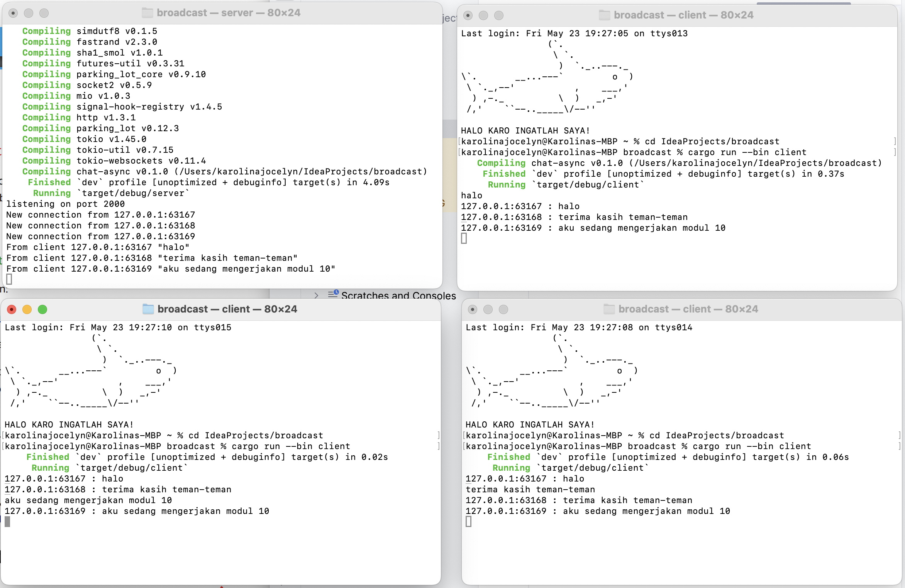
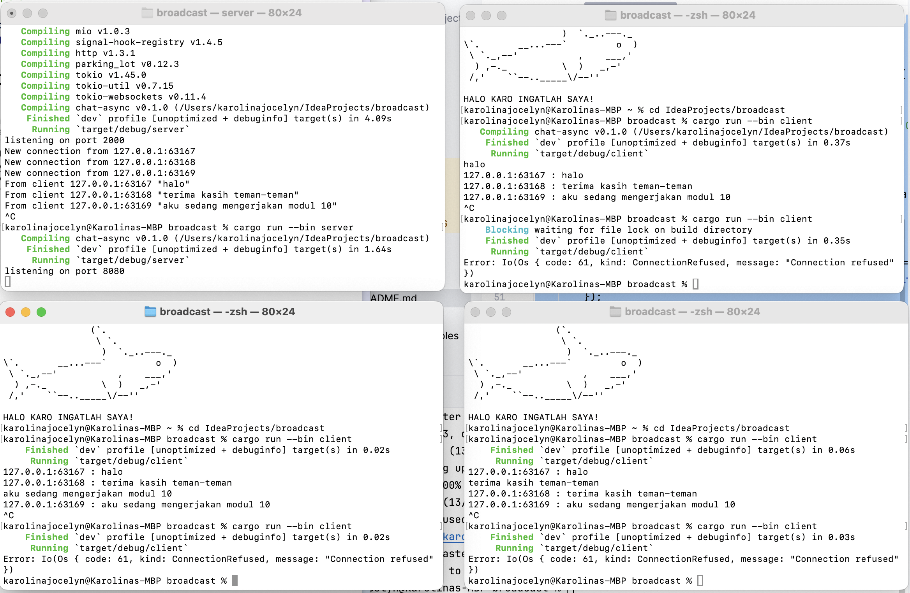

# broadcast-module10

### Experiment 2.1: Original code, and how it run

Saya menjalankan satu server terlebih dahulu dengan perintah cargo run --bin server, lalu buka tiga terminal lain dan jalankan masing-masing client dengan cargo run --bin client. Setelah semua client terhubung, setiap kali salah satu client mengirim pesan, server akan menerima pesan tersebut dan langsung menyebarkannya ke seluruh client yang sedang terhubung, termasuk ke pengirimnya sendiri. Hal ini dimungkinkan karena server menggunakan channel broadcast untuk mengelola semua client yang terkoneksi secara konkuren. Seperti ditunjukkan pada gambar, saat salah satu client mengirim pesan seperti "halo" atau "aku sedang mengerjakan modul 10", semua client lain akan menerima dan menampilkan pesan tersebut, disertai dengan alamat sumber pengirim. Ini membuktikan bahwa sistem broadcast bekerja dengan baik dan bersifat real-time.

Pada pengujian ini, server telah dimodifikasi untuk mendengarkan koneksi pada port 8080 bukan 2000. Hal ini dilakukan dengan mengganti baris TcpListener::bind("127.0.0.1:2000") menjadi TcpListener::bind("127.0.0.1:8080") pada file server.rs. Setelah perubahan dilakukan, server berjalan normal dan siap menerima koneksi. Namun, ketika client dijalankan tanpa perubahan port, mereka masih mencoba terhubung ke ws://127.0.0.1:2000, yang menyebabkan kegagalan koneksi dengan pesan error ConnectionRefused. Ini karena WebSocket bersifat koneksi dua arah, dan klien harus menyambung ke port yang sama dengan yang digunakan oleh server.

Solusinya adalah dengan memperbarui baris ClientBuilder::from_uri(Uri::from_static("ws://127.0.0.1:2000")) di client.rs menjadi ws://127.0.0.1:8080, agar klien dapat tersambung ke server dengan benar. Keduanya tetap menggunakan WebSocket, dengan awalan ws:// pada URI, yang menandakan bahwa komunikasi terjadi menggunakan WebSocket.
